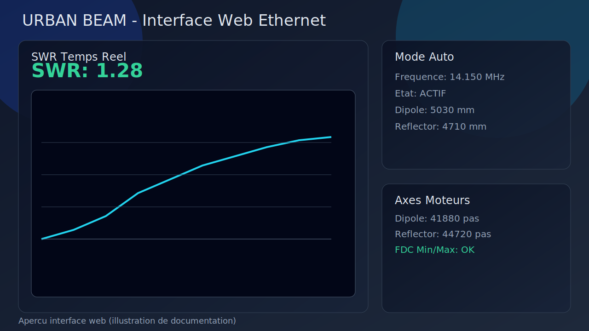
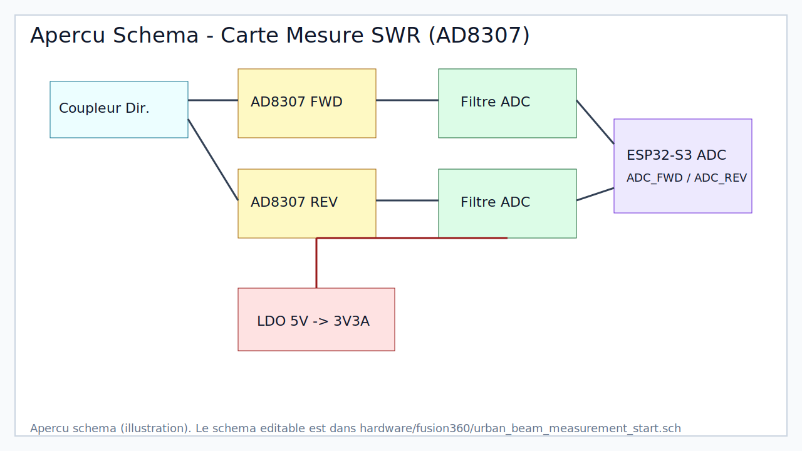
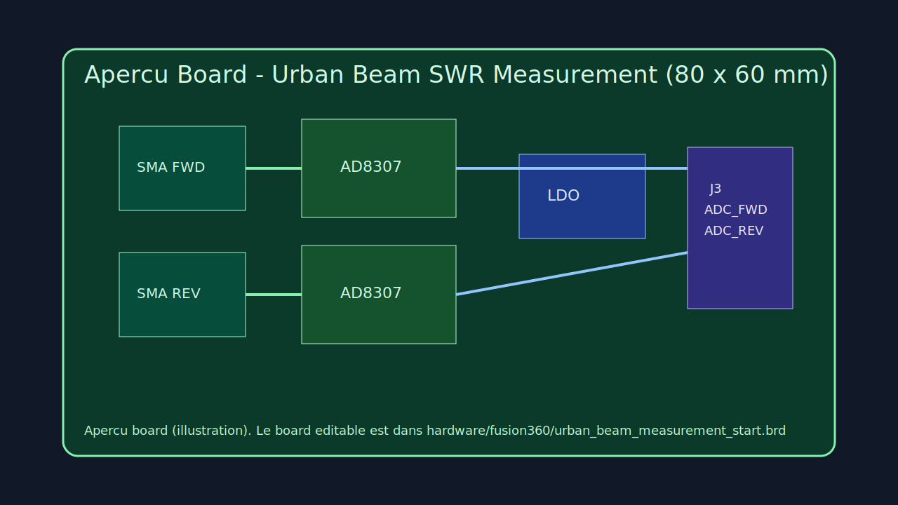

# URBAN BEAM controlLer - ESP32-S3 Ethernet

Projet de controle d'antenne avec ESP32-S3 Ethernet et 2 axes moteurs pas a pas:

- Axe 1: ajustement dipole
- Axe 2: ajustement reflector

Strategie de reglage:

1. pre-positionnement par formule selon la frequence,
2. optimisation finale par tatonnement en fonction du ROS (SWR) mesure.

## Captures et apercus

### Capture interface web



### Apercu schema electronique



### Apercu board PCB



## Fonctions implementees

- Pilotage 2 axes STEP/DIR/ENABLE avec AccelStepper.
- 2 fins de course par axe (min/max, logique active LOW).
- Serveur HTTP embarque en Ethernet SPI (W5500).
- API HTTP:
  - /api/state
  - /api/frequency?mhz=...
  - /api/auto?on=1|0
  - /api/jog?motor=0|1&delta=...
  - /api/home?motor=0|1
  - /api/stop?motor=0|1
- Affichage SWR temps reel avec graphe live.
- Prepositionnement theorique:
  - Dipole: 1/4 lambda = ((300 / Fe) * 0.95) / 4
  - Reflector: 1/4 lambda = ((300 / Fe) * 0.89) / 4
- Auto-reglage par tatonnement SWR:
  - alternance des axes,
  - inversion du sens si la mesure ne s'ameliore pas,
  - pas adaptatif.

## Arborescence utile

- src/main.cpp: firmware complet.
- platformio.ini: environnement PlatformIO et dependances.
- hardware/fusion360/urban_beam_measurement_start.sch: base schema Fusion 360.
- hardware/fusion360/urban_beam_measurement_start.brd: base board Fusion 360.
- hardware/fusion360/measurement_design_notes.md: notes design carte mesure.

## Parametres a adapter pour Waveshare ESP32-S3-ETH-8DI-8RO-C

Dans src/main.cpp:

- broches Ethernet SPI: ETH_MISO_PIN, ETH_MOSI_PIN, ETH_SCK_PIN, ETH_CS_PIN, ETH_RST_PIN.
- broches moteurs/fins de course: motorPins.
- broches ADC de mesure SWR: FORWARD_POWER_ADC_PIN, REFLECTED_POWER_ADC_PIN.
- calibration mecanique:
  - DIPOLE_REF_LENGTH_MM, REFLECTOR_REF_LENGTH_MM
  - DIPOLE_REF_STEPS, REFLECTOR_REF_STEPS
  - DIPOLE_STEPS_PER_MM, REFLECTOR_STEPS_PER_MM

## Calibration SWR

Le calcul SWR actuel est une approximation de demarrage a partir des tensions AD8307.

Etapes recommandees:

1. calibrer Vf et Vr avec charges connues,
2. etablir la conversion tension -> puissance,
3. valider le SWR sur charge 50 ohms puis antenne reelle.

## Build et flash

```bash
pio run
pio run -t upload
pio device monitor
```

Au boot, l'adresse IP Ethernet est affichee sur le port serie:

```text
Ethernet IP: x.x.x.x
```

## Creation repository GitHub

Option en ligne de commande (si gh est installe et authentifie):

```bash
git init
git add .
git commit -m "Initial commit: URBAN BEAM ESP32-S3 Ethernet controller"
gh repo create urban-beam-controller --public --source=. --remote=origin --push
```

Option manuelle:

1. creer un repo vide sur GitHub,
2. lier le remote:

```bash
git remote add origin <URL_DU_REPO>
git branch -M main
git push -u origin main
```
